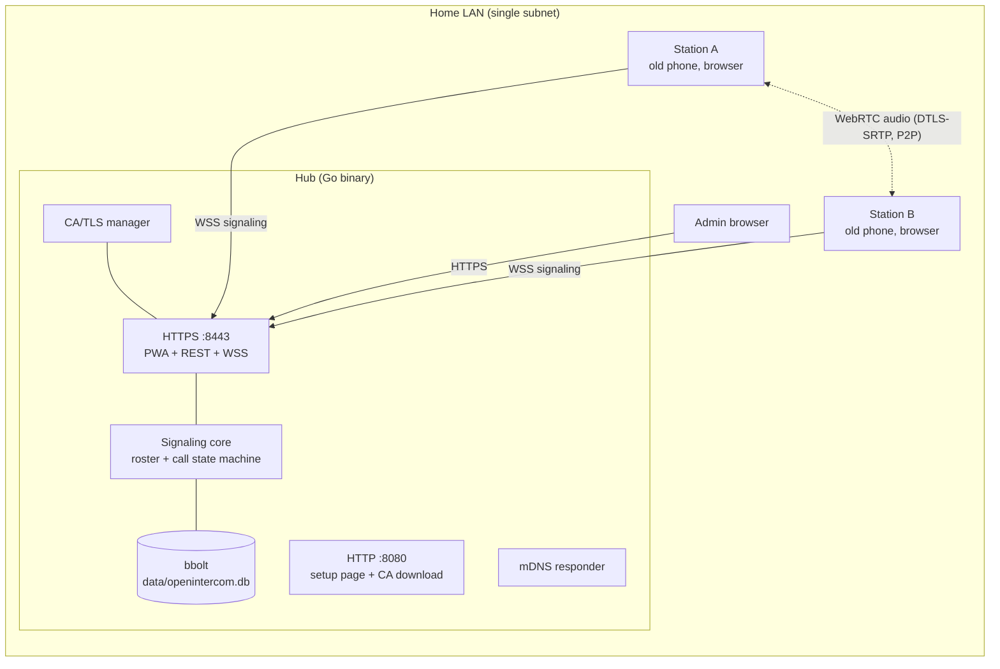

# OpenIntercom v1 Design

Status: canonical design for v1. Issues in [docs/issues/](issues/) reference the
numbered sections below; treat section numbers as stable anchors.

Related documents:
[ISSUE_PLAN.md](ISSUE_PLAN.md) ·
ADRs [001](decisions/ADR-001-client-pwa-over-native.md)
[002](decisions/ADR-002-lan-tls-private-ca.md)
[003](decisions/ADR-003-hub-topology-and-p2p-media.md)
[004](decisions/ADR-004-go-hub-bbolt-preact.md)
[005](decisions/ADR-005-lan-only-v1.md)
[006](decisions/ADR-006-stations-are-dedicated-terminals.md) ·
research [secure-context](research/secure-context-lan-https.md)
[webrtc-old-devices](research/webrtc-pwa-support-old-devices.md)

---

## 1. Product overview

**OpenIntercom turns retired smartphones into a home intercom network.** A small
always-on hub (Go single binary on a Raspberry Pi, NAS or leftover PC) serves a
web app on the home LAN. Each old phone sits in a dock, screen on, opened to that
app, and becomes a named *station* ("Kitchen", "Kids Room", "Workshop"). Any
station can call any other; the call rings loudly, is answered with one oversized
green button, and carries full-duplex speakerphone audio directly between the two
phones.

Product principles, in priority order:

1. **It must ring.** Call delivery reliability beats every other feature.
2. **Grandma-operable.** One screen, huge buttons, no accounts, no jargon.
3. **Private by structure.** LAN-only, no cloud, media peer-to-peer and encrypted;
   the hub never touches audio (ADR-003, ADR-005).
4. **Old hardware is the point.** iOS 15 Safari is the capability floor (ADR-001).
5. **Boring to operate.** One binary, one data directory, one config file.

Positioning vs. prior art: SIP stacks (Asterisk/linphone/baresip) are far more
capable and far too heavy to set up for a family; commercial intercoms need new
hardware; smart-speaker intercom features require cloud accounts and compatible
speakers. OpenIntercom's niche: zero-account, LAN-only, reuse-what-you-own,
5-minute setup per device.

## 2. Personas and core user stories

| Persona | Description |
|---|---|
| **Installer** | The technical family member. Runs the hub, pairs devices, is the only one who ever sees the admin UI. |
| **Resident** | Everyone in the household, ages ~5–90. Interacts only with the station screen. |
| **Contributor** | OSS developer. Needs one-command dev environment and CI that tells the truth. |

User stories (US-n are referenced by issues):

- **US-1 Install**: Installer runs one binary (or `docker run`) on an always-on
  box, sets the admin password via CLI, opens `/admin`, and sees an empty station
  list. ≤15 minutes.
- **US-2 Enroll a station**: Installer generates a pairing code in the admin UI;
  on the old phone they visit the hub's setup URL, install/trust the CA (guided,
  per-OS), open the station app, enter the code, name the station, grant mic
  permission, tap "enable sound", follow keep-awake instructions, dock the phone.
  ≤5 minutes per device.
- **US-3 Call**: Resident taps "Kitchen" on the Living Room station. Kitchen
  rings loudly with a full-screen incoming card. Grandma taps the green button;
  they talk hands-free; either side taps the red button to end.
- **US-4 No answer**: Kids Room doesn't answer for 45 s. Caller sees "no answer";
  Kids Room shows a missed-call badge on the caller's tile.
- **US-5 Busy**: Calling a station already in a call yields an immediate busy
  indication without disturbing the ongoing call.
- **US-6 Revoke**: A station phone is lost/repurposed. Installer deletes it in
  the admin UI; its token is dead within seconds and every roster updates.
- **US-7 Recover**: Power outage. Hub reboots, stations auto-reconnect, rosters
  converge with no human action.
- **US-8 Contribute**: Contributor clones the repo; `make dev` gives hot-reload
  frontend + local hub; `make test && make e2e` reproduce CI locally.

## 3. Scope

### 3.1 v1 scope

- Hub: TLS/CA subsystem, pairing, roster/presence, server-authoritative 1:1 call
  signaling, admin API+UI, event log, mDNS advertisement, embedded PWA.
- Station PWA: onboarding, roster, outgoing/incoming/active call UX, reconnect,
  i18n (en/ja).
- Packaging: binaries (linux amd64/arm64/armv7, darwin arm64/amd64, windows
  amd64), multi-arch Docker image, systemd unit, install & device-setup docs.

### 3.2 v1 non-goals (hard exclusions)

- No WAN/cloud/remote access (ADR-005). No push notifications (ADR-006).
- No video, no broadcast/announce, no monitoring/babyphone mode (v2 candidates).
- No audio recording or interception anywhere, ever (privacy stance §9.8).
- No STUN/TURN relay (ADR-003), no multi-hub, no per-person accounts (stations
  are rooms), no federation.
- No native apps.

### 3.3 v2 candidate backlog (deferred, deliberately designed-around)

Broadcast/announce (one-to-all), door-station mode with video, monitor mode with
strong consent UX, hub-embedded TURN for AP-isolation homes, phone-as-hub,
companion mode for carried phones, optional Let's Encrypt mode, Prometheus
metrics endpoint, native Android kiosk wrapper. Each keeps a placeholder in
§ where relevant so v1 interfaces don't preclude it.

## 4. System architecture



Key properties: one hub process; stations hold exactly one WSS connection each;
media never transits the hub; everything except the bootstrap setup page is
served over TLS from the hub-issued certificate (ADR-002).

## 5. Technology summary

See ADR-004 for rationale. Go ≥1.24, `CGO_ENABLED=0`; stdlib `net/http` (1.22+
ServeMux); `coder/websocket`; `bbolt`; `cobra`; `x/crypto/argon2`;
`skip2/go-qrcode`; frontend TypeScript + Vite + Preact + signals, two entries
(station `index.html`, admin `admin/index.html`); `go:embed` of `web/dist`.
Module path: `github.com/Saber5656/openintercom`.

Repository layout (created by issue 01):

```
cmd/openintercom/main.go        # cobra wiring only
internal/config/                # §6.2
internal/store/                 # §6.3
internal/ca/                    # §6.5
internal/auth/                  # §6.7 auth primitives
internal/httpserver/            # §6.4 routing+middleware
internal/api/                   # §6.7 REST handlers
internal/ws/                    # §6.8 connection layer
internal/signal/                # §6.9–6.11 roster + state machine + router
internal/mdns/                  # §6.13
internal/events/                # §6.12
internal/webassets/             # go:embed of web/dist
internal/version/               # ldflags-injected version
web/                            # Vite project (§7, §8)
deploy/systemd/openintercom.service
docs/
.github/workflows/
Makefile
```

## 6. Hub server design

### 6.1 Process model and CLI

Single process, no privileges required (unprivileged ports). Subcommands:

| Command | Behavior |
|---|---|
| `openintercom serve` | Loads config (§6.2), opens store, ensures CA/leaf (§6.5), starts HTTPS+HTTP listeners, mDNS, signal core. Flags: `--config PATH`, `--dev-web-proxy URL` (dev only: proxy non-`/api` to Vite). Graceful shutdown on SIGINT/SIGTERM: close WS with code 1001, flush store, exit ≤5 s. |
| `openintercom version` | Prints `openintercom <semver> (<commit>, <date>)`. Version injected via `-ldflags -X`. |
| `openintercom admin set-password` | Interactive, no-echo prompt (min 8 chars, confirm twice); writes argon2id hash to store. The **only** way to (re)set the admin password. Refuses non-TTY stdin unless `--stdin` is passed (for tests). |
| `openintercom cert info` | Prints CA subject, SHA-256 fingerprint (formatted `AA:BB:…`), validity, leaf SANs and expiry. Used for TOFU verification (§6.6). |
| `openintercom cert rotate-server` | Re-issues the leaf from the existing CA immediately. |
| `openintercom healthcheck [--url URL]` | Exits 0 iff `GET /healthz` returns 200. Default URL derived from config. For Docker HEALTHCHECK (distroless has no shell). |

Startup order in `serve`: config → logging → store open+migrate → CA ensure →
leaf ensure/reissue (§6.5) → signal core → HTTP servers → mDNS → ready log line
(includes both URLs and CA fingerprint). Any failure = log + non-zero exit; no
partial starts.

### 6.2 Configuration

File `config.yaml`, located via `--config`, else `$OPENINTERCOM_CONFIG`, else
`./config.yaml`, else built-in defaults (a missing file is not an error).
Environment overrides: `OPENINTERCOM_<UPPERCASED_KEY>` (e.g.
`OPENINTERCOM_DATA_DIR`). Precedence: flags > env > file > defaults.

| Key | Type / default | Validation |
|---|---|---|
| `listen_https` | string `":8443"` | valid host:port; port 1-65535 |
| `listen_http` | string `":8080"` | as above; `""` disables the setup listener entirely |
| `hostname` | string `""` | optional; RFC 1123 label(s); added to leaf SANs |
| `mdns_name` | string `"openintercom"` | RFC 1123 label; advertised as `<mdns_name>.local` |
| `advertise_mdns` | bool `true` | — |
| `data_dir` | string `"./data"` | created `0700` if missing; must be writable; refuse if world-writable |
| `log_level` | string `"info"` | one of `debug info warn error` |
| `log_format` | string `"text"` | `text` or `json` |

Config carries **deployment** concerns only; runtime product settings (ring
timeout, hub display name) live in the store (§6.3) and are edited in the admin
UI. Unknown keys = hard error (typo protection). `internal/config.Load()` returns
a validated immutable struct; all validation errors reported at once.

### 6.3 Data store (bbolt)

Single file `<data_dir>/openintercom.db`, mode `0600`. bbolt with
`Options{Timeout: 1s}` (fail fast if another instance holds the lock — exactly
one hub per data dir). Buckets and key encodings:

| Bucket | Key | Value (JSON unless noted) |
|---|---|---|
| `meta` | `schema_version` | uint64 as decimal string; v1 schema = `1`; open fails on newer-than-known version |
| `settings` | setting name | JSON scalar. Defined settings: `hub_name` (string, default `"OpenIntercom"`, 1–32 chars), `ring_timeout_s` (int, default `45`, range 10–120) |
| `stations` | station id (UUIDv4 string) | `{"id","name","icon","token_sha256","created_at","last_seen_at"}` — `name`: validated per §9.6; `icon`: preset id string; `token_sha256`: hex; timestamps RFC 3339 UTC |
| `pairings` | pairing id (UUIDv4) | `{"id","code_sha256","created_at","expires_at","used_at":null\|ts}` |
| `admin` | `password_hash` | argon2id PHC string (`$argon2id$v=19$m=65536,t=1,p=4$…`) |
| `admin_sessions` | session token SHA-256 hex | `{"created_at","expires_at","csrf"}` |
| `events` | seq (uint64 big-endian bytes) | event record (§6.12); pruned to newest 500 on insert |

`internal/store` exposes typed DAOs (`Stations`, `Pairings`, `Settings`,
`AdminSessions`, `Events`) — callers never see bbolt types. All writes go through
`store.Update`; reads through `store.View`. Migration = switch on
`schema_version` applying forward-only steps inside one transaction.

Plaintext bearer tokens and pairing codes are **never stored** — SHA-256 only
(§9.3). Loss of the DB = re-pair devices; no backup subsystem in v1 (documented;
the file can be copied while the hub is stopped).

### 6.4 HTTP server and middleware

Two `http.Server` instances:

- **HTTPS `listen_https`**: PWA assets, REST `/api/v1/*`, WSS `/api/v1/ws`.
  TLS min 1.2 (default curves/suites), `GetCertificate` from the CA manager so
  leaf rotation needs no restart.
- **HTTP `listen_http`** (optional): setup page + CA download + redirect (§6.6).
  **Never** serves the app or any `/api` route (except `GET /api/v1/ca.crt`).

Middleware chain (order): panic-recovery → request-id → access-log (slog) →
security headers → rate limiter (keyed per §9.7) → body limit (64 KiB JSON
routes) → router.

Security headers, all HTTPS responses:

| Header | Value |
|---|---|
| `Content-Security-Policy` | `default-src 'self'; script-src 'self'; style-src 'self'; img-src 'self' data:; connect-src 'self'; media-src 'self' blob:; frame-ancestors 'none'; base-uri 'none'; form-action 'self'` |
| `Strict-Transport-Security` | `max-age=31536000` (no preload — private names) |
| `X-Content-Type-Options` | `nosniff` |
| `Referrer-Policy` | `no-referrer` |
| `Permissions-Policy` | `microphone=(self), camera=(), geolocation=()` |
| `Cache-Control` | hashed assets `public, max-age=31536000, immutable`; HTML & API `no-store` |

No inline scripts/styles anywhere (Vite configured accordingly) so the CSP holds.
Static serving: embedded FS with SPA fallback (unknown non-`/api` GET →
`index.html`; `/admin/*` → `admin/index.html`).

REST envelope: success `{"ok":true,"data":…}`; error
`{"ok":false,"error":{"code":"<snake_case>","message":"<human string>"}}`.
Codes: `invalid_request`, `unauthorized`, `forbidden`, `not_found`, `conflict`,
`pairing_failed`, `rate_limited`, `admin_not_configured`, `internal`. HTTP status
mirrors the class (400/401/403/404/409/429/500). Requests with wrong
`Content-Type` → 415; bodies over limit → 413.

`GET /healthz` (both listeners): `200 {"ok":true,"data":{"status":"ok"}}` — no
version, no auth, no side effects.

### 6.5 TLS and private CA subsystem (`internal/ca`)

Files under `<data_dir>/ca/`: `ca.crt`, `ca.key`, `server.crt`, `server.key`
(keys `0600`, dir `0700`). Behavior per ADR-002:

- **Ensure-CA**: if absent, generate ECDSA P-256; subject
  `CN=OpenIntercom Home CA <8-hex-random>`; 10-year validity; `CA:true,
  pathlen:0`; KeyUsage `certSign|crlSign`; **critical NameConstraints**
  permitting DNS: `<mdns_name>.local` + `hostname` (if set). IP name-type left
  absent (= unconstrained, RFC 5280 §4.2.1.10).
- **Ensure-leaf**: generate/reissue when: missing, expires <30 days, or desired
  SAN set ≠ current SAN set. Desired SANs: `<mdns_name>.local`, `hostname` (if
  set), `localhost`, `127.0.0.1`, plus every non-loopback private IPv4 currently
  assigned. Validity 825 days. EKU serverAuth.
- Fingerprint helper: SHA-256 of CA cert DER, colon-formatted.
- If config `mdns_name`/`hostname` changes such that NameConstraints no longer
  cover the leaf SANs → refuse to start with an actionable error naming the
  CLI escape hatch (documented CA rotation).
- Startup warning (not fatal) if any key file is group/world-readable.

### 6.6 First-run setup flow (HTTP listener)

Routes on `listen_http`:

| Route | Behavior |
|---|---|
| `GET /` | Static setup page (embedded, en/ja by `Accept-Language` with manual toggle): ① what this is; ② CA download button; ③ per-OS trust instructions (iOS two-step trust! Android warning explanation); ④ the CA SHA-256 fingerprint rendered large with "compare with `openintercom cert info`"; ⑤ link to `https://<best-name>:<https-port>/` (best-name = hostname > mdns > primary IP as detected). |
| `GET /ca.crt` | CA certificate, DER, `Content-Type: application/x-x509-ca-cert`, `Content-Disposition: attachment; filename="openintercom-ca.crt"`. Also available on the HTTPS listener at `/api/v1/ca.crt`. |
| anything else | 302 → `https://<best-name>:<https-port>/`. |

The setup page is deliberately dependency-free static HTML/CSS (no app JS) —
it must render on anything.

### 6.7 REST API catalog

All JSON under `/api/v1`. Auth column: `public` (rate-limited), `station`
(`Authorization: Bearer oit_…`), `admin` (session cookie + CSRF header §9.2).

| # | Method & path | Auth | Request | Response `data` | Errors |
|---|---|---|---|---|---|
| R1 | `POST /api/v1/pair` | public | `{"code":"12345678","name":"Kitchen","icon":"kitchen"}` | `{"station":{…§6.3},"token":"oit_<43 b64url chars>","hub":{"name":…},"settings":{"ring_timeout_s":…}}` | `pairing_failed` (unknown/expired/used code — indistinguishable on purpose), `conflict` (duplicate name), `invalid_request`, `rate_limited` |
| R2 | `GET /api/v1/me` | station | — | `{"station":{…},"hub":{"name"},"settings":{…}}` | `unauthorized` (token unknown/revoked) |
| R3 | `DELETE /api/v1/me` | station | — | `{}` — self-unpair: deletes station, closes its WS, logs event | `unauthorized` |
| R4 | `GET /api/v1/ca.crt` | public | — | DER bytes (not enveloped) | — |
| R5 | `POST /api/v1/admin/login` | public | `{"password":"…"}` | `{}` + cookies (§9.2) | `unauthorized`, `admin_not_configured`, `rate_limited` |
| R6 | `POST /api/v1/admin/logout` | admin | — | `{}`; deletes session | — |
| R7 | `GET /api/v1/admin/session` | admin | — | `{"authenticated":true,"csrf":"<token>"}` (UI bootstrap) | `unauthorized` |
| R8 | `GET /api/v1/admin/stations` | admin | — | `[{"id","name","icon","created_at","last_seen_at","online":bool,"busy":bool,"mic":"ok\|blocked\|unknown"}]` | — |
| R9 | `PATCH /api/v1/admin/stations/{id}` | admin | `{"name":?, "icon":?}` | updated station | `not_found`, `conflict`, `invalid_request` |
| R10 | `DELETE /api/v1/admin/stations/{id}` | admin | — | `{}` — revoke: delete record, close WS (code 4401), end its call session as `ended/error` | `not_found` |
| R11 | `POST /api/v1/admin/pairings` | admin | `{}` | `{"id","code":"12345678","expires_at","qr_svg":"<svg…>","pair_url":"https://…"}` — **plaintext code & QR only in this response** | — |
| R12 | `GET /api/v1/admin/pairings` | admin | — | `[{"id","created_at","expires_at","used_at"}]` (no codes) | — |
| R13 | `DELETE /api/v1/admin/pairings/{id}` | admin | — | `{}` (revoke unused code) | `not_found` |
| R14 | `GET /api/v1/admin/settings` | admin | — | `{"hub_name","ring_timeout_s"}` | — |
| R15 | `PUT /api/v1/admin/settings` | admin | full settings object | updated settings; ring-timeout change applies to *new* calls | `invalid_request` |
| R16 | `GET /api/v1/admin/events?limit=50&before_seq=N` | admin | — | `{"events":[…§6.12],"next_before_seq":N\|null}` newest-first | `invalid_request` |
| R17 | `GET /api/v1/admin/cert` | admin | — | `{"ca_fingerprint_sha256","ca_not_after","server_sans":[…],"server_not_after"}` | — |
| R18 | `POST /api/v1/admin/cert/rotate-server` | admin | — | new leaf summary (R17 shape) | `internal` |
| R19 | `GET /api/v1/admin/info` | admin | — | `{"version","uptime_s","listen_https","listen_http","stations_online":n}` | — |

Pairing semantics (R11/R1): code = 8 crypto-random digits; TTL 10 min; single
use; ≤5 unused codes may exist at once (creating a 6th deletes the oldest);
consumed atomically with station creation.

### 6.8 WebSocket protocol (`/api/v1/ws`, HTTPS listener only)

Envelope (JSON text frames, one message per frame):

```json
{"v":1,"type":"call.invite","seq":42,"payload":{…}}
```

`v` fixed `1` (server closes 4400 on mismatch). `seq`: optional client-side
monotonic int; server echoes it as `ref` inside `error` payloads. Server→client
messages carry no `seq`. Max frame 128 KiB; oversize → close 4400.

Handshake: HTTP upgrade requires an `Origin` header exactly matching one of the
hub's own HTTPS origins (scheme+host+port for every leaf SAN name); then the
client must send `auth` within 5 s or the server closes 4401.

Message catalog (C=client/station, S=server):

| Type | Dir | Payload | Semantics |
|---|---|---|---|
| `auth` | C→S | `{"token":"oit_…"}` | First message. OK → `auth.ok`; bad → `auth.err` + close 4401. |
| `auth.ok` | S→C | `{"station":{id,name,icon},"settings":{ring_timeout_s},"roster":[RosterEntry],"active_call":CallState\|null}` | Session established; `active_call` lets a reconnecting client resync (§6.11). |
| `auth.err` | S→C | `{"code":"unauthorized"}` | Followed by close 4401. |
| `ping` | C→S | `{"t":<ms>}` | Client sends every 25 s. |
| `pong` | S→C | `{"t":<echo>}` | — |
| `roster.update` | S→C | `{"stations":[RosterEntry]}` | Full snapshot on any change (n≤~16, snapshots beat deltas). RosterEntry = `{"id","name","icon","online":bool,"busy":bool,"mic":"ok\|blocked\|unknown"}`; includes self. |
| `station.status` | C→S | `{"mic":"ok"\|"blocked"}` | Mic permission telemetry → roster. |
| `call.invite` | C→S | `{"callee_id":"<uuid>"}` | Start a call (§6.10 guards). |
| `call.state` | S→C | `{"session_id","role":"caller"\|"callee","peer":{id,name,icon},"state":"ringing"\|"connecting"\|"active"\|"ended","reason":EndReason\|null,"started_at"}` | **Authoritative**; pushed to both parties on every transition. Clients render exactly this. |
| `call.accept` / `call.decline` / `call.cancel` / `call.hangup` | C→S | `{"session_id"}` | Guarded per §6.10; stale/foreign session_id → `error` `stale_session` (no state change). |
| `call.media` | C→S | `{"session_id","state":"connected"}` | Sent when `pc.connectionState=="connected"`; first one flips session to `active`. |
| `webrtc.offer` / `webrtc.answer` | C→S→peer | `{"session_id","sdp":"<opaque>"}` | Relay-only (§6.11). |
| `webrtc.ice` | C→S→peer | `{"session_id","candidate":{…}}` | Relay-only; `null` candidate = end-of-candidates, relayed as-is. |
| `error` | S→C | `{"code","message","ref":<seq>\|null}` | Codes: `bad_message`, `busy`, `peer_unavailable`, `stale_session`, `rate_limited`, `internal`. |

Close codes: `4400` protocol violation · `4401` auth failure/timeout/revoked ·
`4409` superseded by a newer connection from the same station (newest wins) ·
`1001` server shutdown. Server drops connections silent >60 s. Per-connection
inbound rate: 30 msg/s sustained, burst 60 → `error rate_limited`, then close
4400 on continued abuse. `last_seen_at` updated on any inbound message
(persisted lazily, ≥1/min).

### 6.9 Presence and roster (`internal/signal`)

A station is `online` iff it has an authenticated WS connection. In-memory
registry: `station_id → conn`. On connect/disconnect/rename/revoke/mic-change/
busy-change → recompute and broadcast `roster.update` to all connected stations
(coalesced: max one broadcast per 100 ms). `busy` = participant of a session in
state `ringing|connecting|active`.

### 6.10 Call session state machine

One in-memory session table; **at most one live session per station** (as caller
or callee). Sessions are never persisted (§10). States:
`ringing → connecting → active → ended(reason)`.
EndReason: `declined | canceled | timeout | connect_failed | hangup |
peer_disconnected | error | unavailable | busy`.

Invite guards (evaluated atomically under the signal-core lock):

| Guard failed | Result to caller |
|---|---|
| callee unknown / not online | `error peer_unavailable` |
| callee == caller | `error bad_message` |
| callee busy (live session) | `error busy` |
| caller busy | `error busy` |

Transition table (authoritative; "timer" events fire on the hub):

| # | State | Event | Next | Effects |
|---|---|---|---|---|
| T1 | — | `call.invite` (guards pass) | `ringing` | create session (UUIDv4); push `call.state ringing` to both; start ring timer = `ring_timeout_s` |
| T2 | ringing | callee `call.accept` | `connecting` | cancel ring timer; push `connecting` ×2; start connect timer 20 s |
| T3 | ringing | callee `call.decline` | `ended/declined` | push ×2 |
| T4 | ringing | caller `call.cancel` | `ended/canceled` | push ×2 |
| T5 | ringing | ring timer fires | `ended/timeout` | push ×2; event log `call.missed` |
| T6 | ringing | callee disconnects | `ended/unavailable` | push to caller |
| T7 | ringing | caller disconnects | `ended/canceled` | push to callee (stop ringing) |
| T8 | connecting | `webrtc.*` from a participant | `connecting` | relay to the other participant (§6.11) |
| T9 | connecting | first `call.media connected` | `active` | cancel connect timer; push `active` ×2; event `call.answered` |
| T10 | connecting | connect timer fires | `ended/connect_failed` | push ×2 (UI: "couldn't connect — see troubleshooting") |
| T11 | connecting/active | `call.hangup` (either) | `ended/hangup` | push ×2; event `call.ended` + duration |
| T12 | active | participant disconnected >15 s (grace timer) | `ended/peer_disconnected` | push to survivor |
| T13 | any live | participant revoked (R10/R3) | `ended/error` | push to survivor; close revoked WS 4401 |
| T14 | ringing/connecting/active | duplicate `call.invite` from participant | unchanged | `error busy` to sender |

Rules: events not listed for a state are ignored with `error stale_session`
(idempotent; late/duplicate frames must not corrupt state). `ended` sessions are
dropped from the table immediately after the final push (event log is the
history). All state changes emit both `call.state` pushes *inside* the same
lock-scope ordering to keep both parties' views consistent.

Reconnect semantics: WS drop during `ringing` ends the session (T6/T7 — no
mid-ring recovery in v1). During `connecting`/`active`, a 15 s grace timer (T12)
allows quick re-auth; `auth.ok.active_call` re-syncs the client; a client that
receives `active_call` for a call it no longer has locally must reply
`call.hangup`.

### 6.11 SDP/ICE relay rules

The hub relays `webrtc.offer|answer|ice` **only** between the two participants
of a `connecting|active` session named by `session_id`; sender must be a
participant; payload is opaque (never parsed/rendered); size ≤64 KiB;
per-session relay budget 200 messages (exceeding → `ended/error` + log) to bound
abuse. Role rule: caller is the offerer; exactly one offer/answer pair expected;
extra offers are still relayed (client ignores) but count against the budget.

### 6.12 Event log (`internal/events`)

Append-only, capped 500 (§6.3). Record:
`{"seq","ts","type","station_id":?,"peer_id":?,"session_id":?,"reason":?,"duration_s":?,"detail":?}`.
Types: `station.paired`, `station.renamed`, `station.revoked`,
`station.self_unpaired`, `pairing.created`, `pairing.revoked`, `call.started`,
`call.answered`, `call.missed`, `call.ended`, `admin.login`,
`admin.login_failed`, `admin.settings_changed`, `cert.rotated`, `hub.started`.
Never logged: tokens, codes, passwords, SDP, audio (nonexistent anyway).
This is a *convenience log*, not an audit trail (cap + no tamper protection —
stated in docs).

### 6.13 mDNS (`internal/mdns`)

When `advertise_mdns`: publish A/AAAA for `<mdns_name>.local` → hub addresses,
via a pure-Go responder (`hashicorp/mdns` or equivalent — final pick documented
in issue 18 with a comparison note). Best-effort subsystem: failures log
`warn` and never block startup. Known platform flakiness (Android) is why every
URL surface also shows the IP form (§6.6, admin pairing `pair_url`).

### 6.14 Logging and observability

`log/slog`, level/format from config. Every request: request-id, method, path
(no query — pairing codes never appear in URLs by design, but belt-and-braces),
status, duration, remote IP. WS: connect/auth/disconnect with station id + close
code. Signal core: every transition (T-number, session, states) at `debug`;
call summary at `info`. No metrics endpoint in v1 (v2: Prometheus).

## 7. Station PWA design

### 7.1 App structure

`web/src/`:

```
main.tsx            # station entry
admin-main.tsx      # admin entry (§8)
lib/ws.ts           # WS client (§7.3)
lib/api.ts          # typed REST client (fetch, envelope unwrap)
lib/protocol.ts     # TS types mirroring §6.7/§6.8 (single source: hand-written, reviewed against DESIGN)
lib/call.ts         # WebRTC module (§7.4)
lib/audio.ts        # ringtones, unlock, volumes (§7.5)
lib/wake.ts         # keep-awake progressive enhancement (§7.6)
lib/i18n.ts + i18n/{en,ja}.json
lib/storage.ts      # localStorage schema (§7.9)
views/…             # per-screen Preact components (§7.2)
state.ts            # app store: signals for conn/roster/call/ui
```

State model: a single reducer-ish store fed by exactly two sources — WS messages
and local UI intents. Derived rendering only; no component talks to the network
directly.

### 7.2 Screens and UI states

| Screen | Content / behavior |
|---|---|
| **Onboarding wizard** (no token) | Steps: ① language auto+toggle → ② connection check (if reached over HTTP, redirect to setup page §6.6) → ③ pairing-code entry (8-digit keypad) + station name (preset room chips + free text ≤24 chars) + icon pick → calls R1 → ④ mic permission prime (explainer, then `getUserMedia`; on deny: per-OS fix instructions, `station.status mic:blocked`) → ⑤ "enable sound" tap (audio unlock §7.5, plays test chime) → ⑥ keep-awake instructions per OS (§7.6) → done. |
| **Home / roster** | Header: hub name, self station name, connection dot. Grid of peer tiles (icon, name, state: grey=offline, green=idle, amber=busy, badge=missed count). Tap idle tile → invite. Tap gear → settings. Banner area for `reconnecting` / `mic blocked`. |
| **Outgoing call** (full-screen overlay) | Callee name+icon, "calling…" pulse, ring-back tone, big red cancel. Renders `call.state ringing(role=caller)`. |
| **Incoming call** (full-screen overlay) | Caller name huge, ringtone loud + vibration (where available), giant green Accept / red Decline (≥64 px targets, ≥24 px gap). Renders `ringing(role=callee)`. |
| **Active call** | Peer name, live duration, mute toggle (local track `enabled=false`), big red hang-up. Subtle connection indicator from `pc.connectionState`. Renders `connecting`(“connecting…”)/`active`. |
| **Call ended interstitial** (2 s) | Reason text: declined / no answer / busy / connection failed (+link to troubleshooting) / ended. |
| **Settings** | Ring volume slider + test button, language toggle, keep-awake guide, diagnostics (WS state, last error, versions), "Forget this station" (confirm → R3 → wipe storage → onboarding). |

All strings via i18n; no text baked into components.

### 7.3 WS client (`lib/ws.ts`)

Connect to `wss://<location.host>/api/v1/ws`; send `auth` immediately; surface
typed events to the store. Heartbeat `ping` every 25 s; if no `pong`/message for
40 s force-reconnect. Reconnect backoff `[1,2,4,8,15,30]s` + full jitter,
forever; "reconnecting" banner after 5 s offline. On `auth.err`/HTTP 401 →
wipe token → onboarding ("this station was removed"). On close 4409 → passive
"opened elsewhere" screen (do not reconnect-fight). Tab-visibility: on
`visibilitychange→visible`, if socket not OPEN reconnect immediately.

### 7.4 WebRTC call module (`lib/call.ts`)

Per session: `new RTCPeerConnection({iceServers: []})`. Caller flow on
`connecting`: `getUserMedia(§7.5 constraints)` → `addTrack` → `createOffer` →
`setLocalDescription` → send `webrtc.offer`. Callee: on offer →
`setRemoteDescription` → gUM → `addTrack` → `createAnswer` → send. Both:
trickle ICE via `webrtc.ice` (including null end-marker); remote track → single
`<audio autoplay playsinline>` element. On `connectionState=="connected"` → send
`call.media connected`. Watchdog: `failed`, or `disconnected` >10 s → send
`call.hangup` (hub ends `hangup`; UI shows connection-failed reason from local
knowledge). Full teardown on `ended`: stop tracks, close pc, release audio
element. No renegotiation; `onnegotiationneeded` ignored by design.

### 7.5 Audio

- gUM constraints: `{audio: {echoCancellation:true, noiseSuppression:true,
  autoGainControl:true}, video:false}`.
- Ringtone & ring-back & chime: WebAudio oscillator patterns (license-free, tiny;
  exact patterns defined in issue 24); ring volume from settings (§7.9), test
  button in settings.
- Autoplay policy: one-time unlock — resume `AudioContext` inside the
  onboarding "enable sound" tap; if a later load finds the context `suspended`,
  a full-screen "tap to enable sound" overlay appears before anything else
  (a station that cannot ring must never *look* ready).

### 7.6 Keep-awake

Per research: request Screen Wake Lock where available; re-acquire on
`visibilitychange`. Where unavailable (iOS 15/16.0–16.3): rely on OS settings;
onboarding step ⑥ shows per-OS instructions (iOS Auto-Lock Never + Guided
Access; Android keep-awake-while-charging / screen pinning). A persistent
settings-page note shows current wake-lock status (`active / unsupported`).

### 7.7 PWA shell

`manifest.webmanifest` (name, icons from a generated SVG glyph set, standalone
display, portrait). Service worker: precache hashed assets (cache-first),
`index.html` network-first with cache fallback; `/api/*` **never** cached.
Update flow: on new SW waiting → toast "Update ready — tap to reload". iOS note:
running as a Safari *tab* is equally supported (ADR-006); add-to-home-screen is
optional polish.

### 7.8 i18n

`lib/i18n.ts`: key-based `t()`, catalogs `en.json`/`ja.json`, locale =
stored override ?? `navigator.language` prefix match ?? `en`. CI check: catalogs
must have identical key sets (script in issue 19).

### 7.9 Client-side storage (localStorage)

| Key | Value |
|---|---|
| `oi.token` | station bearer token (see §9.2 threat note) |
| `oi.station` | cached `{id,name,icon}` for instant boot render |
| `oi.locale` | `"en"\|"ja"` (absent = auto) |
| `oi.ringVolume` | 0.0–1.0, default 1.0 |
| `oi.soundUnlocked` | `"1"` after first unlock (informational) |
| `oi.missed` | JSON `{[stationId]: {count, last_ts}}`, cleared per-tile on tap |

"Forget this station" clears all `oi.*` keys after R3 succeeds.

## 8. Admin UI design

Separate Vite entry `/admin/` (assets not loaded by station app). Screens:

| Screen | Content |
|---|---|
| **Login** | Password field → R5. `admin_not_configured` → instruction card quoting `openintercom admin set-password`. |
| **Stations** (default) | Table: name+icon, online/busy/mic, last seen, created; actions rename (inline, R9), remove (confirm dialog naming consequences, R10). Empty state points to Pairing. |
| **Pairing** | "New pairing code" button → R11 → full-screen result: giant 8-digit code, QR (`qr_svg`), `pair_url` text, expiry countdown; below, active codes list (R12) with revoke (R13). |
| **Settings** | hub name, ring timeout (10–120 s) → R15. |
| **Events** | Newest-first list (R16), human-readable rendering per type, "load more" pagination. |
| **Security** | CA fingerprint (large, copyable), CA download link, leaf SANs + expiries (R17), rotate-server-cert button (confirm, R18), hub info (R19). |

Session behavior: on any 401 → login screen. CSRF header on every mutating
request (§9.2). Admin UI is desktop-first responsive; same i18n system.

## 9. Security model

### 9.1 Threat model and trust boundaries

Assets: live room audio (highest), station tokens, admin credential, CA private
key, event log. Adversaries considered: devices on the same LAN (guests,
compromised IoT), a person with brief physical access to a docked station, a
stolen/discarded station phone. Out of scope (ADR-005): internet attackers
(hub must never be WAN-exposed), malicious hub administrator (the installer is
trusted), OS/browser compromise of a station.

Trust boundaries:

| Boundary | Protection |
|---|---|
| Browser ↔ hub (HTTP API/WS) | TLS (hub CA), bearer token / admin session, origin check, rate limits, input validation |
| Station ↔ station (media) | DTLS-SRTP, keys via signaling over WSS; hub never holds media keys' fingerprint verification (a=fingerprint in relayed SDP) — MITM requires an active hub compromise, accepted (hub is trusted) |
| First-run HTTP setup page | TOFU, mitigated by fingerprint display (§6.6) |
| Hub ↔ disk | file modes 0600/0700, no plaintext secrets at rest (§9.3) |
| LAN ↔ internet | none needed: no listener may be exposed; docs + SECURITY.md warnings |

### 9.2 AuthN/AuthZ

Principals: **public**, **station** (bearer `oit_` + 32 random bytes b64url;
SHA-256 at rest; constant-time compare on lookup), **admin** (argon2id
`m=64MiB,t=1,p=4` password; session cookie `oi_admin` = `ois_`+random 256-bit,
`HttpOnly; Secure; SameSite=Strict; Path=/`, 24 h TTL, sliding renewal; CSRF =
per-session random token returned by R5/R7, required as `X-OI-CSRF` header on
every non-GET admin request).

Authorization matrix (enforced in `internal/httpserver` middleware, tested by
issue 29):

| Surface | public | station | admin |
|---|---|---|---|
| PWA assets, `/healthz`, `GET ca.crt`, `POST pair`, `POST admin/login` | ✅ | ✅ | ✅ |
| `GET/DELETE /api/v1/me`, WS `/api/v1/ws` | ❌ | ✅ | ❌ |
| `/api/v1/admin/*` (rest) | ❌ | ❌ | ✅ |

A station token grants exactly: its own `me` endpoints and its own WS session.
No station-to-station authority exists server-side beyond placing a call.

Token-in-localStorage note: XSS is the theft vector; mitigations are the strict
CSP (§6.4, no inline, self-only), zero third-party scripts, and full input
validation (§9.6). Accepted trade-off for v1 (documented) — cookies would
complicate the WS auth and multi-station-per-browser debugging without removing
the XSS class.

### 9.3 Pairing security

8-digit crypto-random code (10^8 space), 10-min TTL, single use, ≤5 outstanding,
stored hashed, consumed atomically. Rate limits (§9.7) cap online guessing at
~50 attempts per code lifetime globally (≪10^8). Codes travel out-of-band
(installer reads/scans them). `pairing_failed` never distinguishes
wrong/expired/used. Plaintext code appears only in the R11 response and is never
logged (assert in tests).

### 9.4 Transport security

TLS ≥1.2 on everything except the bootstrap listener (§6.6, which serves only
public bytes and instructions); WSS-only signaling (WS upgrade requires the
origin check; no token in URLs — first-message auth §6.8); WebRTC media is
DTLS-SRTP end-to-end between stations.

### 9.5 CA risk containment

See ADR-002: name-constrained CA, key `0600`, CLI-only CA rotation, fingerprint
surfaced in three places (setup page, admin Security screen, `cert info`).
Abuse case "malicious fake hub on the LAN offering a CA": documented — pairing
requires a code from the *real* admin, and the fake CA's fingerprint won't match
the CLI output; residual TOFU risk accepted (§9.1).

### 9.6 Input validation (every externally reachable field)

| Input | Rule |
|---|---|
| Station name | UTF-8, NFC-normalized, 1–24 chars after trim, no control chars, uniqueness case-folded |
| Icon | member of the preset id list (else `invalid_request`) |
| Pairing code | exactly `[0-9]{8}` |
| Admin password (set) | 8–128 chars |
| Settings | `hub_name` 1–32 chars; `ring_timeout_s` int 10–120 |
| WS envelope | known `type`, `v==1`, payload schema per type, frame ≤128 KiB |
| SDP / ICE blobs | opaque; ≤64 KiB; relayed only per §6.11; never parsed, logged, stored, or rendered |
| UUIDs in paths/payloads | RFC 4122 syntax before lookup |
| JSON bodies | `Content-Type: application/json`, ≤64 KiB, unknown fields rejected on admin/settings writes |

Rendering rule: every dynamic string rendered via Preact text nodes (auto-
escaped); `dangerouslySetInnerHTML` is forbidden (lint rule, issue 19).

### 9.7 Rate limits and DoS posture

Token-bucket per key, in-memory:

| Surface | Limit |
|---|---|
| `POST /api/v1/pair` | 5/min + 20/hour per IP; 30/hour global |
| `POST /api/v1/admin/login` | 5/min per IP + 20/hour global; on trip: 429 + event `admin.login_failed` |
| WS connects | 10/min per IP |
| WS inbound | 30 msg/s, burst 60, per connection (§6.8) |
| SDP relay | 200 messages per session (§6.11) |
| Other API | 60/min per IP default bucket |

DoS stance: a LAN flooder can degrade service (accepted — physical-layer
adversary); limits exist to stop *quiet* brute force and runaway clients, not
line-rate floods.

### 9.8 Privacy stances (product commitments)

No audio recording, storage, or interception — structurally impossible at the
hub (media is P2P; ADR-003). No telemetry, no external calls at runtime. Event
log is capped, local, and admin-visible only. Mic indicator: browsers already
show capture indicators; the UI additionally shows an explicit in-call screen at
all times when the mic is live (no hidden-call code path exists — enforced by
the state machine: media only in `connecting|active`). These commitments go in
README and SECURITY.md verbatim.

### 9.9 Secrets and file hygiene

At rest: only argon2id hash (admin) and SHA-256 digests (tokens/codes); CA/leaf
keys `0600` in `data/ca/`. Logs never contain: tokens, codes, passwords, SDP,
`Authorization` headers (access-logger allowlists fields). Config file contains
no secrets by design (§6.2). Backup guidance: copy `data/` cold; treat it as
sensitive (CA key inside).

### 9.10 Supply chain

Go and npm dependencies pinned by lockfiles; the allowed direct-dependency list
lives in ADR-004 and additions require review. CI (issue 02): `govulncheck`,
`npm audit --audit-level=high` (fail on high+), CodeQL (Go+JS), Dependabot
(weekly, grouped). GitHub Actions pinned to commit SHAs with least-privilege
`permissions:` blocks. Release artifacts ship SHA-256 checksums (issue 31).

### 9.11 Abuse cases → tests

Issue 29 turns these into a permanent test suite: revoked-token WS/REST reuse;
cross-station `session_id` forgery (T14/stale rules); admin API with station
token (matrix §9.2); missing/mismatched Origin on WS; CSRF header absent;
pairing brute-force → 429; oversized frames/bodies; malformed JSON/fuzzed WS
envelopes (Go fuzz); duplicate-name pairing; self-call; parallel invite races
(two invites to one callee — exactly one `ringing`, one `busy`).

## 10. Reliability and failure modes

| Failure | Behavior |
|---|---|
| Hub restart / power loss | Sessions are memory-only → gone. Stations reconnect (backoff §7.3), receive `auth.ok` with `active_call:null`, reset to idle. In-flight media dies with the pc teardown watchdog. `hub.started` event logged. Recovery target: all stations green ≤60 s after boot (US-7). |
| Station WS drop mid-ring | T6/T7: ring ends immediately (no ghost ringing). |
| Station WS drop mid-call | Media may survive briefly (P2P); T12 grace 15 s for WS re-auth; else survivor gets `ended/peer_disconnected`; client watchdog (§7.4) also fires on media loss. |
| ICE failure (AP isolation, cross-VLAN) | T10 `connect_failed` ≤20 s with troubleshooting link (docs issue 32 §AP-isolation). |
| mDNS unavailable | Cosmetic: IP URLs everywhere (§6.13). |
| Disk full / store write error | Log `error`; presence/calls continue (memory); pairing/settings writes fail with `internal`; health stays 200 (liveness only). Documented operator signal: error logs. |
| Hub IP changed | Leaf auto-reissue at next start (§6.5); stations reach the hub by the *name* they bookmarked — docs recommend DHCP reservation; troubleshooting covers the IP-bookmark case. |
| Clock skew on stations | All authoritative timing is hub-side; clients render only relative durations. |
| Two hubs on one LAN | bbolt lock prevents same-data-dir duplicates; two distinct hubs are two distinct products (different CAs/names) — documented, not prevented. |

## 11. Packaging, deployment, release

- **Binaries**: goreleaser matrix linux/amd64, linux/arm64, linux/arm(v7),
  darwin/arm64, darwin/amd64, windows/amd64; `CGO_ENABLED=0`; version/commit/date
  via ldflags; archives + `checksums.txt` (SHA-256) on GitHub Releases.
- **Docker**: multi-arch (amd64/arm64/armv7) `FROM gcr.io/distroless/static`,
  binary + `HEALTHCHECK` via `openintercom healthcheck`; volume `/data`; example
  `docker run` and compose snippet in docs. Image pushed to GHCR on tag.
- **systemd**: `deploy/systemd/openintercom.service` — dedicated user, hardened
  (`NoNewPrivileges`, `ProtectSystem=strict`, `ReadWritePaths=<data>`,
  `PrivateTmp`, `ProtectHome=read-only`, `CapabilityBoundingSet=`).
- **Versioning**: semver; `v0.x` during waves; `v1.0.0` per ISSUE_PLAN
  completion statement. Release = tag push → release workflow (build, checksums,
  image, notes) — after the manual device checklist (§12.4) passes.

## 12. Testing and validation strategy

### 12.1 Layers

| Layer | Tooling | Owned by |
|---|---|---|
| Go unit (state machine exhaustive, ca, auth, store, config) | `go test`, table-driven, `-race`; fake clock via injected `Clock` interface (`internal/signal` takes `Clock`; no `time.Sleep` in tests) | each server issue |
| Go integration (REST+WS, two scripted fake stations, full call choreography minus media) | `httptest` + real store in `t.TempDir()` | issue 17 |
| Frontend unit (ws client, store reducers, protocol types) | vitest + mock WebSocket | issues 20+ |
| E2E (pair → roster → call → active → hangup, fake mic) | Playwright, chromium ×2 contexts, `--use-fake-device-for-media-stream`, real hub binary on ephemeral ports, `ignoreHTTPSErrors` | issue 30 |
| Security acceptance (abuse cases §9.11) | Go tests + fuzz corpus in CI | issue 29 |
| Manual device matrix | §12.4 checklist | release gate |

### 12.2 CI gates (issue 02)

Every PR: gofmt/golangci-lint, `go test -race ./...`, `tsc --noEmit`, eslint,
vitest, frontend build, embed build (`make build`), govulncheck; E2E on PRs
touching `web/` or `internal/{ws,signal,api}` and always on `main`; CodeQL
scheduled. `main` is protected (existing ruleset); merges via PR only.

### 12.3 Definition of Done (every issue)

Code + tests per the issue's Validation section; lint clean; docs touched if
behavior is user-visible; no new dependency outside ADR-004 without an ADR
update; security-relevant issues additionally satisfy their listed §9 items.

### 12.4 Manual device matrix (release gate for v1.0.0)

On ≥1 iOS 15/16 Safari device and ≥1 Android 9+ Chrome device, on a real
home-grade Wi-Fi AP: CA install + trust flow following only the public docs;
pairing via QR and via typed code; mic permission grant + deny/recover; ring
audibility across a room; answer latency subjective <1.5 s; 5-minute call
stability + AEC sanity (no echo/howl at arm's length); reconnect after Wi-Fi
toggle; overnight idle → still online (keep-awake per §7.6); revoke → station
returns to onboarding. Recorded as a checklist file per release in
`docs/release-checks/`.

## 13. Documentation plan (issues 32/33)

`docs/user/` (EN canonical, JA translation): `install.md` (binary+systemd,
Docker, RPi walk-through), `setup-ios.md`, `setup-android.md` (screenshots,
CA trust, keep-awake), `troubleshooting.md` (AP isolation, mDNS, autoplay,
mic permission, IP changes), `faq.md` (privacy answers, battery, "why
certificate warning"). README gains: promise paragraph, 3-step quickstart,
security-stance summary, screenshots/GIF placeholder, badges.

## 14. Glossary

| Term | Meaning |
|---|---|
| Hub | The Go server process + its data dir; one per home |
| Station | A paired device identity (a room), realized by a phone running the PWA |
| Installer / Admin | Human operating the admin UI/CLI |
| Pairing code | 8-digit, 10-min, single-use enrollment secret |
| Session | One call attempt lifecycle (§6.10), identified by `session_id` |
| Roster | The authoritative station list + live presence, pushed via WS |
| Setup listener | Plain-HTTP bootstrap surface serving CA + instructions only |
