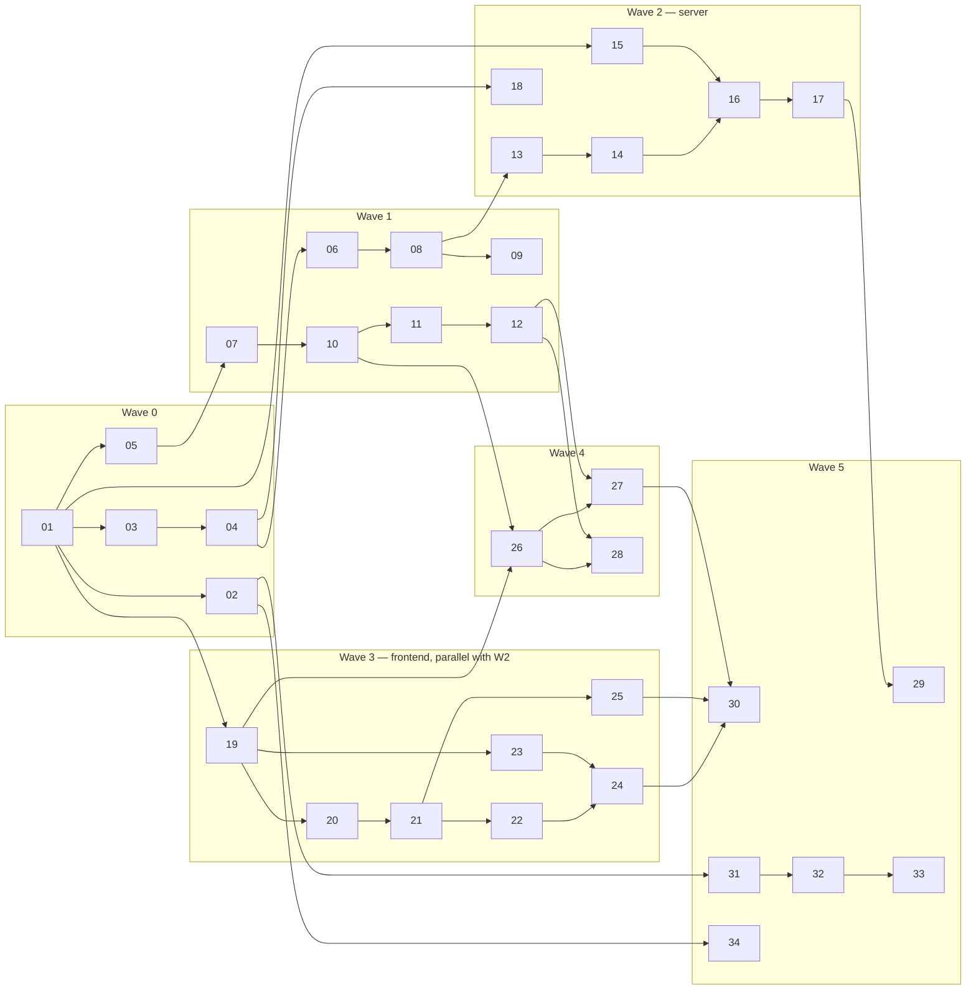

# OpenIntercom v1 Issue Plan

Canonical planning document. Every implementation issue is drafted in
[docs/issues/](issues/) and mirrored to GitHub Issues (GitHub is derived state;
this file + the drafts win on conflict). Design references point at
[DESIGN.md](DESIGN.md) section numbers.

## 1. v1 completion statement

v1.0.0 is complete when **all 34 issues below are closed with their Acceptance
Criteria validated**, and:

1. the E2E suite (issue 30) and security acceptance suite (issue 29) pass in CI
   on `main`;
2. the manual device matrix (DESIGN §12.4) has passed on ≥1 iOS 15/16 Safari
   device and ≥1 Android 9+ Chrome device, recorded in `docs/release-checks/`;
3. a `v1.0.0` release (binaries for linux amd64/arm64/armv7 + darwin + windows,
   multi-arch Docker image, checksums) is published by the release workflow;
4. a household following only `docs/user/` can go from nothing to two paired
   stations completing a call, on a LAN, with no cloud dependency.

At that point the product delivers the full v1 scope of DESIGN §3.1 and nothing
in §3.2. Newly discovered implementation unknowns (see §8) may add issues; they
must be filed as new drafts here first.

## 2. Issue list (recommended execution order)

| ID | Title (file) | Wave | Size | Area |
|---|---|---|---|---|
| 01 | [Repository scaffold and tooling baseline](issues/01-repo-scaffold.md) | 0 | M | infra |
| 02 | [CI pipeline: lint, test, build, security scanning](issues/02-ci-pipeline.md) | 0 | M | ci |
| 03 | [CLI skeleton, logging, version](issues/03-cli-logging-version.md) | 0 | S | server |
| 04 | [Configuration loading and validation](issues/04-config-loader.md) | 0 | S | server |
| 05 | [Embedded data store (bbolt)](issues/05-bbolt-store.md) | 0 | M | server |
| 06 | [Private CA and TLS certificate manager](issues/06-private-ca-tls.md) | 1 | M | server/security |
| 07 | [Auth primitives: tokens, admin password, sessions](issues/07-auth-primitives.md) | 1 | M | server/security |
| 08 | [HTTP server skeleton and security middleware](issues/08-http-server-middleware.md) | 1 | M | server/security |
| 09 | [Setup page and CA download (HTTP listener)](issues/09-setup-page-ca-download.md) | 1 | S | server |
| 10 | [Admin session API: login, logout, CSRF](issues/10-admin-session-api.md) | 1 | M | server/security |
| 11 | [Pairing lifecycle API and station identity endpoints](issues/11-pairing-api.md) | 1 | M | server/security |
| 12 | [Admin management API: stations, settings, events, cert, info](issues/12-admin-management-api.md) | 1 | L | server |
| 13 | [WebSocket endpoint, connection registry, heartbeat](issues/13-ws-endpoint-registry.md) | 2 | M | server |
| 14 | [Presence and roster broadcast](issues/14-presence-roster.md) | 2 | S | server |
| 15 | [Call session state machine (pure module)](issues/15-call-state-machine.md) | 2 | L | server |
| 16 | [Signaling router: wire WS ↔ state machine ↔ relay](issues/16-signaling-router.md) | 2 | L | server |
| 17 | [Signaling integration tests with scripted stations](issues/17-signaling-integration-tests.md) | 2 | M | testing |
| 18 | [mDNS advertisement (best-effort)](issues/18-mdns-publisher.md) | 2 | S | server |
| 19 | [Frontend scaffold: Vite+Preact, embed, i18n, design tokens](issues/19-frontend-scaffold.md) | 3 | M | frontend |
| 20 | [Station WS client library](issues/20-ws-client-lib.md) | 3 | M | frontend |
| 21 | [Onboarding wizard UI](issues/21-onboarding-pairing-ui.md) | 3 | M | frontend |
| 22 | [Roster home screen and settings UI](issues/22-roster-home-ui.md) | 3 | M | frontend |
| 23 | [WebRTC call module](issues/23-webrtc-call-module.md) | 3 | L | frontend |
| 24 | [Call UI: incoming, outgoing, active + ringtones](issues/24-call-ui.md) | 3 | L | frontend |
| 25 | [PWA shell: manifest, service worker, keep-awake](issues/25-pwa-shell.md) | 3 | M | frontend |
| 26 | [Admin UI shell and login](issues/26-admin-ui-shell-login.md) | 4 | M | admin |
| 27 | [Admin UI: stations and pairing](issues/27-admin-ui-stations-pairing.md) | 4 | M | admin |
| 28 | [Admin UI: settings, events, security panel](issues/28-admin-ui-settings-events-cert.md) | 4 | S | admin |
| 29 | [Security acceptance test suite](issues/29-security-acceptance-tests.md) | 5 | M | security/testing |
| 30 | [End-to-end suite (Playwright, fake media)](issues/30-e2e-playwright.md) | 5 | L | testing |
| 31 | [Packaging and release pipeline](issues/31-packaging-release.md) | 5 | M | release |
| 32 | [User documentation (English)](issues/32-user-docs-en.md) | 5 | M | docs |
| 33 | [User documentation (Japanese)](issues/33-user-docs-ja.md) | 5 | S | docs |
| 34 | [Security policy and disclosure docs](issues/34-security-policy.md) | 5 | S | security/docs |

## 3. Dependency table

Build-time dependencies (an issue may *start* earlier against the DESIGN
contract; it may not *close* before its dependencies close).

| ID | Depends on | Notes |
|---|---|---|
| 01 | — | |
| 02 | 01 | CodeQL/Dependabot/govulncheck included here |
| 03 | 01 | |
| 04 | 03 | flags/env wiring |
| 05 | 01 | |
| 06 | 03, 04 | cert CLI subcommands |
| 07 | 03, 05 | `admin set-password` CLI |
| 08 | 03, 04, 06 | TLS listener needs cert manager |
| 09 | 06, 08 | CA bytes + route mount |
| 10 | 07, 08 | |
| 11 | 05, 07, 08, 10 | code creation is admin-authenticated |
| 12 | 05, 06, 10, 11 | cert panel endpoints need 06 |
| 13 | 07, 08, 11 | shares the station-token resolver |
| 14 | 13 | |
| 15 | 01 | pure module; can start any time after scaffold |
| 16 | 13, 14, 15 | |
| 17 | 11, 16 | pairs stations via real API |
| 18 | 03, 04 | independent; any time after wave 0 |
| 19 | 01 | |
| 20 | 19 | develops against mock server per §6.8 |
| 21 | 19, 20 | integration-validated against 11 |
| 22 | 20, 21 | integration-validated against 14/16 |
| 23 | 19 | testable with mocked RTCPeerConnection |
| 24 | 20, 22, 23 | integration-validated against 16 |
| 25 | 19, 21 | |
| 26 | 19, 10 | |
| 27 | 26, 11, 12 | |
| 28 | 26, 12 | |
| 29 | 10, 11, 12, 13, 16, 17 | server surface frozen |
| 30 | 12, 16, 21, 22, 24, 25, 27 | full stack incl. admin pairing view |
| 31 | 02, 03, 19 | adds `healthcheck` subcommand, goreleaser, Docker, systemd |
| 32 | 09, 25, 31 | documents final flows/artifacts |
| 33 | 32 | translation |
| 34 | 01, 02 | any time; scheduled late to capture final posture |

## 4. Implementation waves

| Wave | Goal / demo | Parallelism |
|---|---|---|
| 0 Foundation | `make test` green; `openintercom version` runs; config+store solid | 02–05 parallel after 01 |
| 1 Secure core | `serve` boots HTTPS with own CA; admin can log in (curl); a device can pair (curl) | 06/07 parallel; 09 parallel with 10–12; **15 and 19 may start now** |
| 2 Signaling | two scripted WS clients complete a full call choreography (no media) in integration tests | runs **concurrently with wave 3** — the DESIGN §6.7/§6.8 contract is the interface; frontend uses a mock server until 16 lands |
| 3 Station app | on two laptops/phones against a dev hub: pair, see roster, place a call with real audio | 21/22 sequential; 23 parallel; 24 last; 25 anytime after 21 |
| 4 Admin | installer completes US-1/US-2/US-6 entirely from the browser | 27/28 parallel after 26 |
| 5 Verification & release | CI proves security + E2E; `v0.9.0` release candidate; docs let a stranger self-host; device matrix → `v1.0.0` | 29/30/31/34 parallel; 32→33 |

## 5. Coverage: DESIGN.md sections → issues

| DESIGN § | Covered by |
|---|---|
| §1–3 product, scope | this plan; user-visible framing in 32/33 |
| §4 architecture | structural — all waves |
| §5 layout/stack | 01, 19 |
| §6.1 CLI | 03 (skeleton), 06 (`cert *`), 07 (`admin set-password`), 31 (`healthcheck`) |
| §6.2 config | 04 |
| §6.3 store | 05 |
| §6.4 HTTP+middleware+headers | 08 |
| §6.5 CA/TLS | 06 |
| §6.6 setup flow | 09 |
| §6.7 REST: R1–R3 | 11 |
| §6.7 R5–R7 | 10 |
| §6.7 R8–R19 | 12 |
| §6.7 R4 | 06/08/09 |
| §6.8 WS transport (envelope, auth, heartbeat, closes, limits) | 13 |
| §6.8 call/webrtc message semantics | 16 |
| §6.9 presence/roster | 14 |
| §6.10 state machine | 15 (logic) + 16 (wiring) |
| §6.11 relay rules | 16 |
| §6.12 events | 05 (storage), 12 (API), 11/16 (emission) |
| §6.13 mDNS | 18 |
| §6.14 logging | 03 + per-issue |
| §7.1 app structure | 19 |
| §7.2 onboarding | 21 |
| §7.2 roster/settings | 22 |
| §7.2 call screens | 24 |
| §7.3 WS client | 20 |
| §7.4 WebRTC module | 23 |
| §7.5 audio | 23 (gUM) + 24 (ringtones/unlock) |
| §7.6 keep-awake | 21 (instructions) + 25 (wake lock lib) |
| §7.7 PWA shell | 25 |
| §7.8 i18n | 19 (framework), all UI issues (strings) |
| §7.9 storage | 19 (lib), 21/22 (use) |
| §8 admin UI | 26, 27, 28 |
| §9.1–9.5 security model | 06, 07, 10, 11, 13 — verified by 29 |
| §9.6 input validation | 08, 11, 12, 13 — verified by 29 |
| §9.7 rate limits | 08, 13 — verified by 29 |
| §9.8 privacy | 32, 34 (published commitments) |
| §9.9 secrets/files | 05, 06, 07 |
| §9.10 supply chain | 02, 34 |
| §9.11 abuse cases | 29 |
| §10 reliability | 16, 17, 23, 30 |
| §11 packaging | 31 |
| §12 testing | 02, 17, 29, 30, 31 (§12.4 gate), each issue's Validation |
| §13 docs | 32, 33 |

Every DESIGN behavior lives in at least one issue; anything discovered to be
prose-only during implementation is a planning bug — file a new issue draft.

## 6. Validation strategy (whole product)

Layered per DESIGN §12: unit (Go `-race` + vitest) in every code issue;
protocol-level integration (17) proves the server against scripted clients;
security acceptance (29) turns §9.11 abuse cases into permanent CI tests; E2E
(30) proves the full stack with fake media in Chromium; the §12.4 manual device
matrix is the human release gate on real old phones. CI gates from issue 02
enforce all automated layers on every PR; `main` stays releasable.

## 7. Deferred to v2 (explicitly out of v1)

Broadcast/announce · door-station mode (video) · monitor/babyphone mode (with
consent UX) · hub-embedded TURN relay (AP-isolation rescue) · remote access
design (beyond user VPN docs) · Web Push / carried-phone companion mode ·
phone-as-hub · optional Let's Encrypt mode · Prometheus metrics · native
Android kiosk wrapper · additional locales beyond en/ja · store backup tooling.

## 8. Known unknowns (may spawn new issues)

| # | Unknown | Watched in | Contingency |
|---|---|---|---|
| U1 | iOS enforcement of CA Name Constraints on user-installed roots | 06, device matrix | ship anyway (constraint is defense-in-depth); document |
| U2 | mDNS responder library quality; `.local` resolution on Android browsers | 18 | feature stays best-effort; IP-first UX already designed |
| U3 | Wi-Fi AP/client isolation prevalence in target homes | 30, field feedback | v2 TURN issue if reports accumulate |
| U4 | iOS 15 realities: autoplay unlock edge cases, gUM inside installed-PWA vs Safari tab, 7-day storage eviction | device matrix | fallback = "run in Safari tab" is already the supported mode |
| U5 | Playwright WebKit fake-media support for a Safari-ish E2E lane | 30 | non-blocking; manual matrix covers Safari |
| U6 | AEC quality on old/cheap hardware (echo at high speaker volume) | device matrix | v1.x tuning issue (gain caps, UX guidance) |
| U7 | bbolt behavior on network filesystems | 32 (docs) | "local disk required" documented; refuse-start heuristic if cheap |
| U8 | Go mDNS ICE nuances if mic permission is delayed at callee | 23 | module acquires gUM before SDP answer by design |
